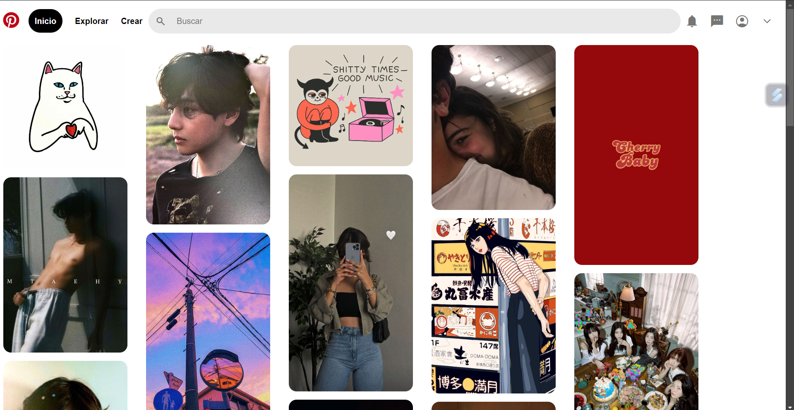

# Proyecto 'Clon de Pinterets' creado en el bootcamp de Tenolochicas Pro

Este fue el segundo proyecto creado en con asesoria de TecnolochicasPro, recreando la pantalla principal de Pinterets
presentando una vista clara, un desplazamiento facil, y una estética limpia.

### Tecnologías usadas:

* HTML
* CSS

### Puedes encontrarlo dando clic abajo
clic aqui[GitHud] (https://github.com/alexaaloey/pinterest-clon)

### Vista Previa <3

